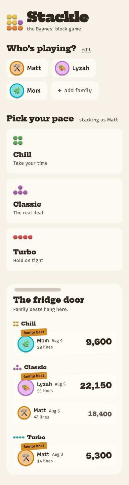
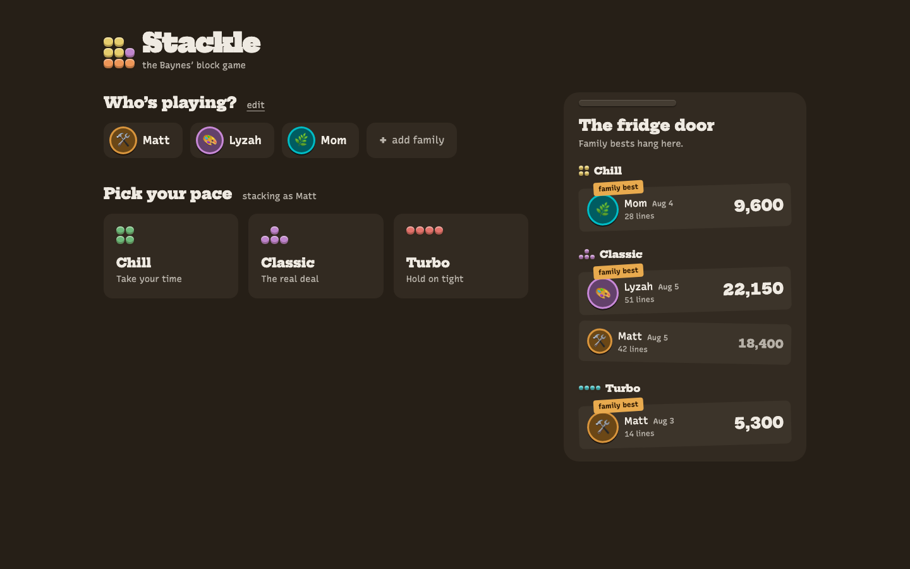
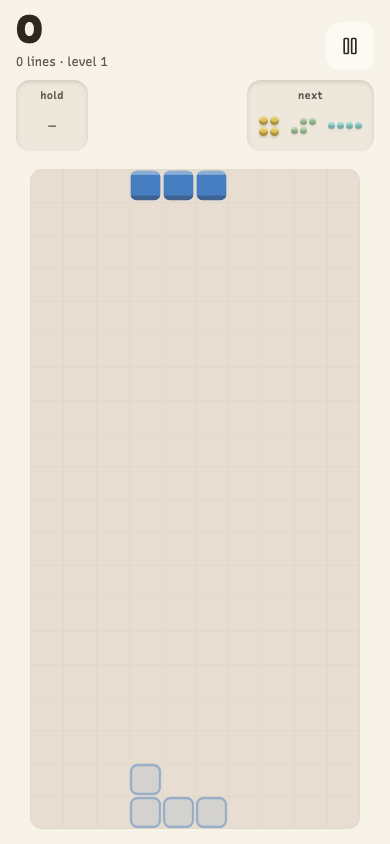
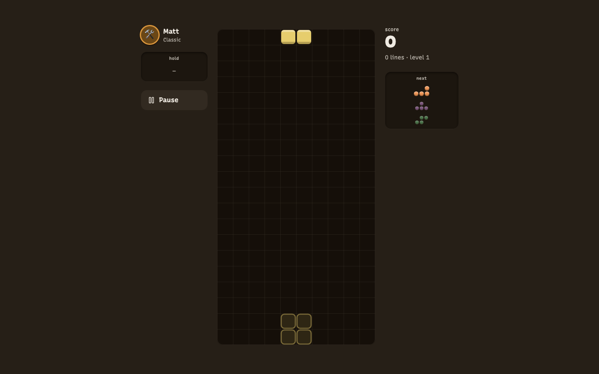
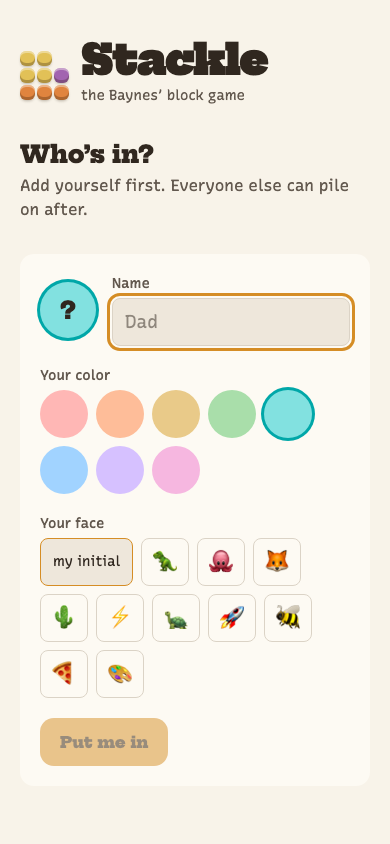
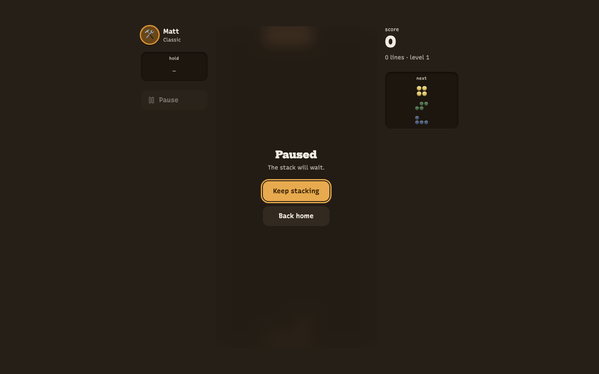

# Stackle

**The Baynes' block game.** A family Tetris-like that feels like a wooden
block puzzle living on the coffee table — play solo on your phone or laptop,
and every score hangs on a shared family fridge door.

**Play it:** [stackle-2mt.pages.dev](https://stackle-2mt.pages.dev)

| Home (light, phone) | Home (dark, laptop) |
| --- | --- |
|  |  |

| Play (light, phone) | Play (dark, laptop) |
| --- | --- |
|  |  |

| First run | Paused |
| --- | --- |
|  |  |

## How it works

- **Pick your name, pick your pace, drop blocks.** Three difficulties:
  Chill ("Take your time"), Classic ("The real deal"), Turbo ("Hold on tight") —
  each with its own leaderboard, so everyone competes on their own terms.
- **The fridge door.** Family bests hang as paper notes pinned by each
  player's avatar magnet. Scores sync across every device through a shared
  leaderboard; the same name on two devices folds into one line.
- **Kind competition.** No panic flashes, no "you lose." Game over is
  "one more go," and family records get a proper celebration.
- **Works offline.** Play never needs the network — scores queue on-device
  and hang themselves on the fridge when you're back online.

Controls: arrows + `Space` hard drop, `Z`/`X` rotate, `C` hold, `P` pause on
keyboard; drag/tap/flick gestures on touch (with an optional button pad).

## Stack

React 19 · TypeScript (strict) · Vite · Tailwind CSS 4 · Zustand ·
canvas renderer · Cloudflare Pages Functions + KV. No game framework,
no component library, no accounts.

The game core (`src/engine/`) is pure, deterministic TypeScript — seeded
7-bag, SRS wall kicks, lock delay, guideline scoring — with a 52-test suite
and zero DOM imports. Design decisions trace to `tasks/design-brief.md` and
`.impeccable.md`.

## Develop

```sh
npm install
npm run dev        # game only (leaderboard API absent — sync stays quiet)
npm run build && npm run dev:cf   # full stack with local KV emulation
npm test           # engine + validation suites
npm run typecheck && npm run lint
```

Deploys automatically on push to `main` (Cloudflare Pages, output `dist/`,
`functions/` picked up automatically, KV bound as `STACKLE_KV` via
`wrangler.jsonc`).

## Roadmap

- Sound effects (tasteful, optional)
- A signature four-line-clear moment
- Daily seed mode — same piece sequence for the whole family each day
- Tune first-score-on-a-difficulty counting as a family record
